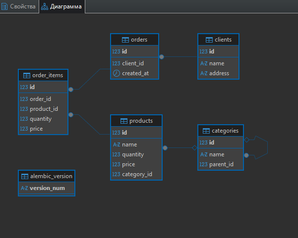

# Ответы на вопросы из задания

## 1. Проектирование схемы БД

### Схема БД



---

## 2. SQL запросы

### 2.1. Сумма заказанных товаров для каждого клиента

Группируем позиции заказов по клиентам и считаем общую сумму:

```sql
SELECT
    c.name AS client_name,
    SUM(oi.quantity * oi.price) AS total_amount
FROM
    clients c
JOIN orders o ON c.id = o.client_id
JOIN order_items oi ON o.id = oi.order_id
GROUP BY c.name
ORDER BY total_amount DESC;
```

### 2.2. Количество дочерних категорий первого уровня

Self-join таблицы категорий для подсчета прямых потомков:

```sql
SELECT
    parent.name AS parent_category_name,
    COUNT(child.id) AS direct_children_count
FROM
    categories AS parent
LEFT JOIN categories AS child ON parent.id = child.parent_id
GROUP BY parent.id, parent.name
ORDER BY parent.name;
```

`LEFT JOIN` гарантирует, что категории без потомков тоже попадут в результат (с count = 0).

### 2.3. Топ-5 самых покупаемых товаров за месяц

#### 2.3.1. Запрос (view) для отчета

Используем рекурсивный CTE для поиска корневой категории каждого товара:

```sql
CREATE OR REPLACE VIEW top_5_monthly_products AS
WITH RECURSIVE category_path AS (
    -- Начальная точка: берем все категории
    SELECT
        id,
        name,
        parent_id,
        id AS root_id,
        name AS root_name
    FROM categories

    UNION ALL

    -- Рекурсивно поднимаемся вверх по дереву
    SELECT
        c.id,
        c.name,
        c.parent_id,
        cp.root_id,
        cp.root_name
    FROM categories c
    JOIN category_path cp ON c.parent_id = cp.id
    WHERE c.parent_id IS NOT NULL
),
root_categories AS (
    -- Выбираем итоговый корень для каждой категории
    SELECT id, root_name 
    FROM category_path 
    WHERE parent_id IS NULL
)
SELECT
    p.name AS product_name,
    rc.root_name AS root_category_name,
    SUM(oi.quantity) AS total_quantity_sold
FROM order_items oi
JOIN orders o ON oi.order_id = o.id
JOIN products p ON oi.product_id = p.id
JOIN root_categories rc ON p.category_id = rc.id
WHERE o.created_at >= NOW() - INTERVAL '1 month'
GROUP BY p.name, rc.root_name
ORDER BY total_quantity_sold DESC
LIMIT 5;
```

**Использование:**
```sql
SELECT * FROM top_5_monthly_products;
```

#### 2.3.2. Анализ производительности и оптимизация

**Проблемы при масштабировании:**

1. **Рекурсивный CTE** - самое узкое место. При больших каталогах обход дерева для каждого товара создает серьезную нагрузку.

2. **Агрегация большого объема данных** - при тысячах заказов в день сканирование `orders` и `order_items` за месяц будет медленным.

3. **OLTP vs OLAP** - тяжелые аналитические запросы на боевой базе замедляют обработку текущих заказов.

**Варианты оптимизации:**

### Вариант 1: Денормализация (добавить поле root_category_id)

Самый эффективный способ - избавиться от рекурсии.

Добавляем в `categories` поле с корневой категорией:

```sql
ALTER TABLE categories ADD COLUMN root_category_id INTEGER;
ALTER TABLE categories ADD CONSTRAINT fk_root_category 
    FOREIGN KEY (root_category_id) REFERENCES categories(id);
```

При создании/изменении категории вычисляем корень один раз (триггер или логика приложения) и сохраняем.

Новый запрос без рекурсии:

```sql
SELECT
    p.name AS product_name,
    root_cat.name AS root_category_name,
    SUM(oi.quantity) AS total_quantity_sold
FROM order_items oi
JOIN orders o ON oi.order_id = o.id
JOIN products p ON oi.product_id = p.id
JOIN categories cat ON p.category_id = cat.id
JOIN categories root_cat ON cat.root_category_id = root_cat.id
WHERE o.created_at >= NOW() - INTERVAL '1 month'
GROUP BY p.name, root_cat.name
ORDER BY total_quantity_sold DESC
LIMIT 5;
```

Два простых JOIN вместо рекурсии - работает на порядки быстрее.

### Вариант 2: Материализованные представления

Для отчетов, которым не нужна актуальность в реальном времени.

```sql
CREATE MATERIALIZED VIEW mv_top_5_monthly_products AS
-- ... (запрос из варианта 1)
```

Результат хранится физически - чтение мгновенное. Обновление по расписанию:

```sql
REFRESH MATERIALIZED VIEW mv_top_5_monthly_products;
```

Можно автоматизировать через cron (например, каждый час).

### Вариант 3: Выделенная аналитическая база (OLAP)

Для высоконагруженных систем.

Создается отдельная база (реплика или специализированное хранилище типа ClickHouse), куда периодически переливаются данные из основной БД. Все тяжелые отчеты выполняются там - полная изоляция от OLTP нагрузки.


